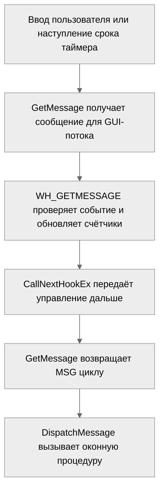
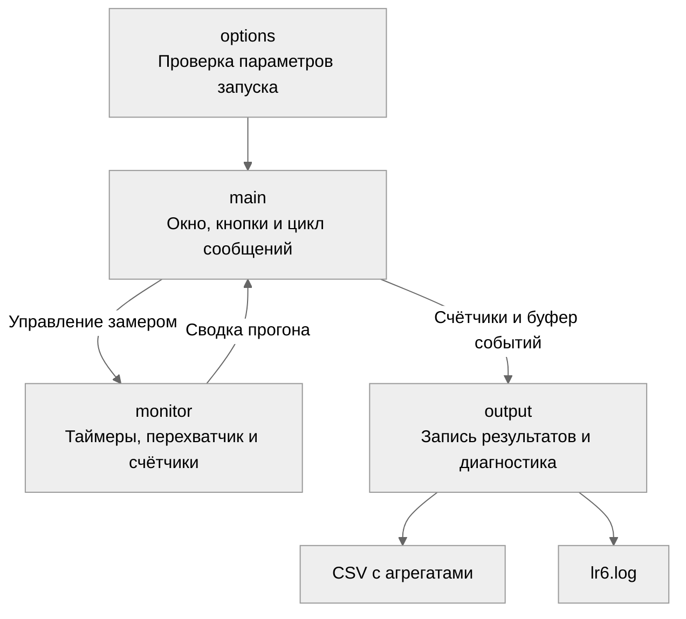
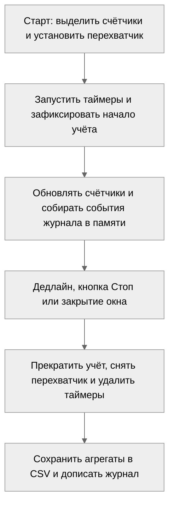

# Схемы для отчёта ЛР №6

## Рисунок 3.1 – Получение оконного сообщения

```mermaid
%%{init: {"theme": "neutral"}}%%
flowchart TD
    A["Ввод пользователя или наступление срока таймера"]
    B["GetMessage получает сообщение для GUI-потока"]
    C["WH_GETMESSAGE проверяет событие и обновляет счётчики"]
    D["CallNextHookEx передаёт управление дальше"]
    E["GetMessage возвращает MSG циклу"]
    F["DispatchMessage вызывает оконную процедуру"]
    A --> B --> C --> D --> E --> F
```

## Рисунок 4.1 – Архитектура приложения

```mermaid
%%{init: {"theme": "neutral"}}%%
flowchart TD
    A["options<br/>Проверка параметров запуска"]
    B["main<br/>Окно, кнопки и цикл сообщений"]
    C["monitor<br/>Таймеры, перехватчик и счётчики"]
    D["output<br/>Запись результатов и диагностика"]
    E["CSV с агрегатами"]
    F["lr6.log"]
    A --> B
    B -->|"Управление замером"| C
    C -->|"Сводка прогона"| B
    B -->|"Счётчики и буфер событий"| D
    D --> E
    D --> F
```

## Рисунок 5.1 – Последовательность действий при замере

```mermaid
%%{init: {"theme": "neutral"}}%%
flowchart TD
    A["Старт: выделить счётчики и установить перехватчик"]
    B["Запустить таймеры и зафиксировать начало учёта"]
    C["Обновлять счётчики и собирать события журнала в памяти"]
    D["Дедлайн, кнопка Стоп или закрытие окна"]
    E["Прекратить учёт, снять перехватчик и удалить таймеры"]
    F["Сохранить агрегаты в CSV и дописать журнал"]
    A --> B --> C --> D --> E --> F
```
